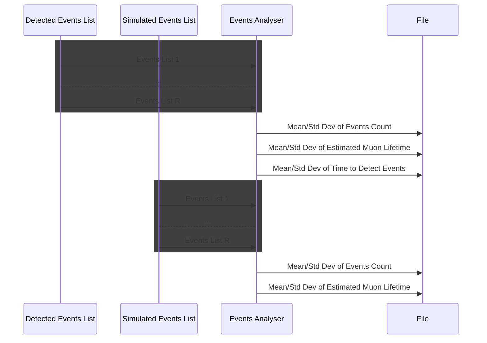

```mermaid
sequenceDiagram
participant D as Detected Events List
participant S as Simulated Events List
participant E as Events Analyser
participant A as File
rect rgb(64,64,64)
    D->>E: Events List 1
    D-->E: ...
    D->>E: Events List R
end
E->>A: Mean/Std Dev of Events Count
E->>A: Mean/Std Dev of Estimated Muon Lifetime
E->>A: Mean/Std Dev of Time to Detect Events
rect rgb(64,64,64)
    S->>E: Events List 1
    S-->E: ...
    S->>E: Events List R
end
E->>A: Mean/Std Dev of Events Count
E->>A: Mean/Std Dev of Estimated Muon Lifetime
```