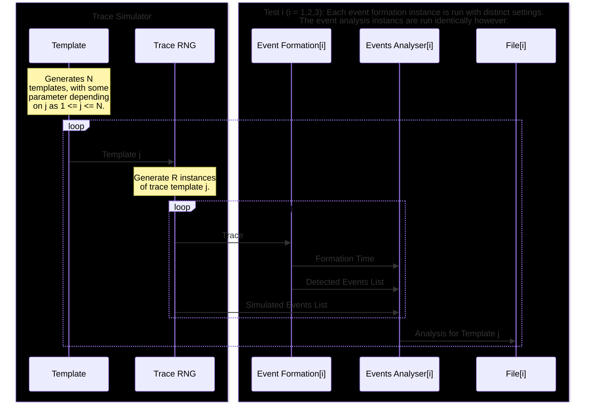

The following diagram illustrates how the tests are run.
Event Formation: this is the actual tool being tested. It is almost exactly how it appears in the data pipeline.
Events Analysis: This tool matches the simulated events list with the corresponding detected events list and compares them.

For each events list, the Event Analyser collates the number of events and the estimated muon lifetime from the data. For each repeated instance of template j, these statistics
