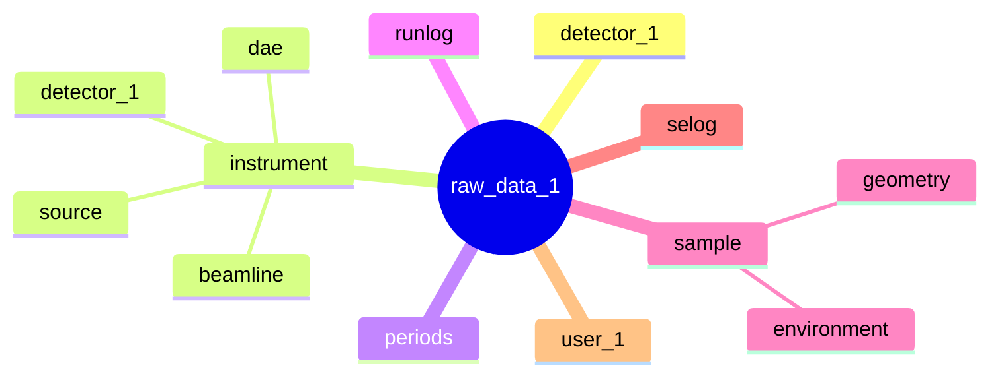

# 9. nexus_file_format

Date: 2024-10-15

## Status

Accepted

## Context

A format .

## Decision

The Nexus File created by the Nexus Writer will adhere to the following format. The group structure is given in the next diagram.

|Group|NXclass|Description|
|-----|-------|-----------|
|raw_data_1|NXentry|The high level container for the file.|

### Group: filename.nxs/raw_data_1

|Group|NXclass|Description|
|-----|-------|-----------|
|detector_1|NXevent_data| |
|instrument|NXinstrument| |
|periods|NXperiods| |
|runlog|NXrunlog| |
|sample|NXsample| |
|selog|NXselog| |
|user_1|NXuser| |

|Dataset|Type|Description|Units|
|-------|----|-----------|-----|
|collection_time|float64| |
|definition|string| |
|definition_local|string| |
|duration|uint32| |
|end_time|string| |
|experiment_identifier|string| |
|good_frames|uint32| |
|idf_version|uint32| |
|notes|string| |
|program_name|string| |
|proton_charge|float64| |
|raw_frames|uint32| |
|run_cycle|string| |
|run_number|uint32| |
|start_time|string| |
|title|string| |
|total_counts|uint32| |

### Group: filename.nxs/raw_data_1/detector_1

|Dataset|Type|Description|Units|
|-------|----|-----------|-----|
|event_id|uint32| |
|event_index|uint64| |
|event_period_number|uint64| |
|event_pulse_height|float64| |
|event_time_offset|uint32| |
|event_time_zero|uint64| |

|Attribute for Dataset|Attribute|Type|Description|
|-------|---------|----|-----------|
|event_time_zero| | | |
| |offset|string| |

### Group: filename.nxs/raw_data_1/runlog

Subgroups of this group have names defined by the runlog message, and NXclass `NXlog`. 

|Group|NXclass|Description|
|-----|-------|-----------|
|{runlog message name}|NXlog| |

The structure of `NXlog` groups is given below.

### Group: filename.nxs/raw_data_1/runlog{runlog message name}

|Dataset|Type|Description|Units|
|-------|----|-----------|-----|
|time|uint32| |
|value|{variable}| |

|Attribute for Dataset|Attribute|Type|Description|
|-------|---------|----|-----------|
|time| | | |
| |offset|string| |

### Group: filename.nxs/raw_data_1/runlog{runlog message name}

## Consequences

What becomes easier or more difficult to do and any risks introduced by the change that will need to be mitigated.

