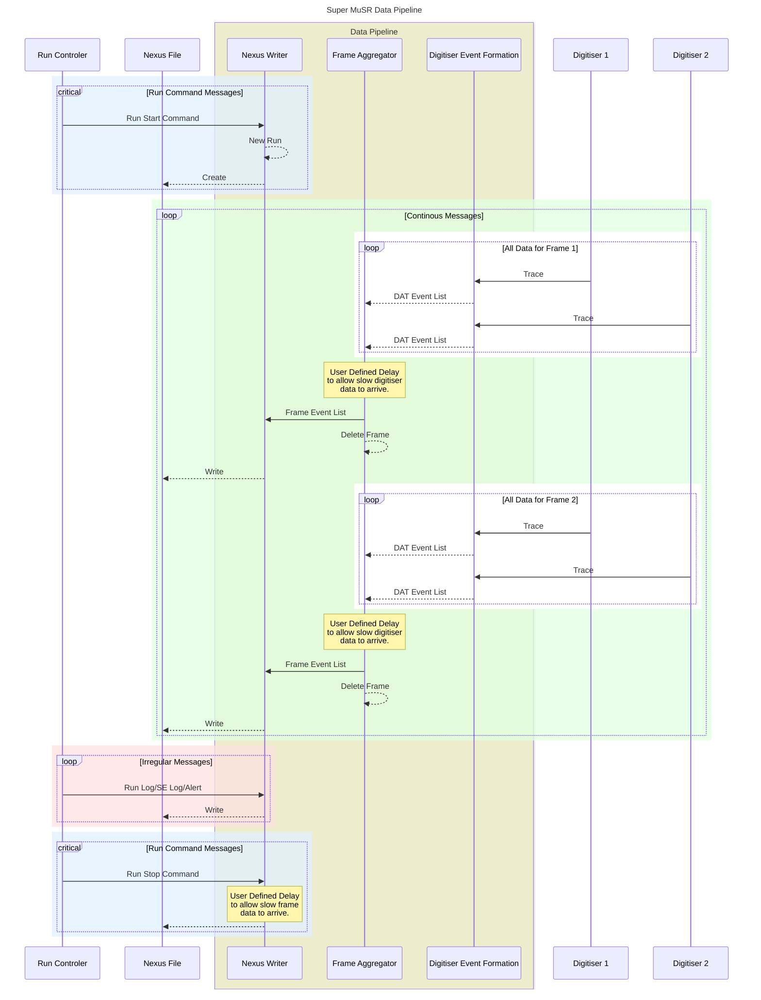

```mermaid
---
title: Super MuSR Data Pipeline
---
sequenceDiagram
participant C as Run Controler
participant X as Nexus File
box rgba(255,255,192,.5) Data Pipeline
    participant W as Nexus Writer
    participant A as Frame Aggregator
    participant E as Digitiser Event Formation
end
participant T1 as Digitiser 1
participant T2 as Digitiser 2

rect rgba(224,240,255,0.75)
    critical Run Command Messages
        C ->> W: Run Start Command
        W -->> W: New Run
        W -->> X: Create
    end
end

rect rgba(224,255,224,.75)
    loop Continous Messages
        rect rgba(255,255,255,1)
            loop All Data for Frame 1
                T1 ->> E: Trace
                E -->> A: DAT Event List
                T2 ->> E: Trace
                E -->> A: DAT Event List
            end
        end
        note over A: User Defined Delay<br/>to allow slow digitiser<br/>data to arrive.
        A ->> W: Frame Event List
        A -->> A: Delete Frame
        W -->> X: Write
        rect rgba(255,255,255,1)
            loop All Data for Frame 2
                T1 ->> E: Trace
                E -->> A: DAT Event List
                T2 ->> E: Trace
                E -->> A: DAT Event List
            end
        end
        note over A: User Defined Delay<br/>to allow slow digitiser<br/>data to arrive.
        A ->> W: Frame Event List
        A -->> A: Delete Frame
        W -->> X: Write
    end
end

rect rgba(256,224,224,.75)
    loop Irregular Messages
        C ->> W: Run Log/SE Log/Alert
        W -->> X: Write
    end
end

rect rgba(224,240,255,0.75)
    critical Run Command Messages
    C ->> W: Run Stop Command
        note over W: User Defined Delay<br/>to allow slow frame<br/>data to arrive.
    W -->> X: 
    end
end
```