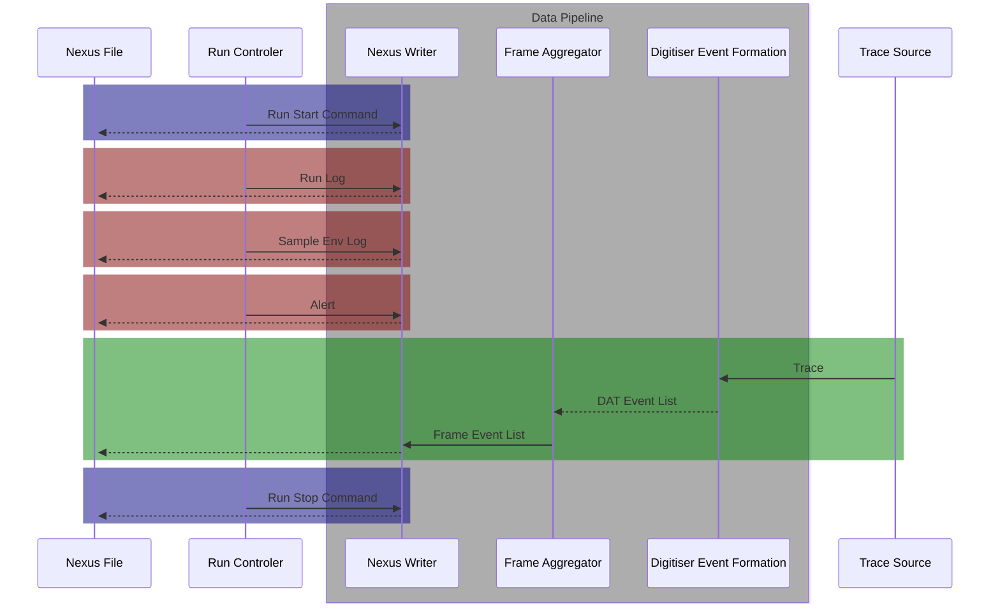

```mermaid
sequenceDiagram
participant X as Nexus File
participant C as Run Controler
box rgba(128,128,128,.5) Data Pipeline
    participant W as Nexus Writer
    participant A as Frame Aggregator
    participant E as Digitiser Event Formation
end
participant T as Trace Source

rect rgba(0,0,128,.5)
C ->> W: Run Start Command
activate X
W -->> X: 
end
rect rgba(128,0,0,.5)
C ->> W: Run Log
W -->> X: 
end
rect rgba(128,0,0,.5)
C ->> W: Sample Env Log
W -->> X: 
end
rect rgba(128,0,0,.5)
C ->> W: Alert
W -->> X: 
end
rect rgba(0,128,0,.5)
T ->> E: Trace
E -->> A: DAT Event List
A ->> W: Frame Event List
W -->> X: 
end
rect rgba(0,0,128,.5)
C ->> W: Run Stop Command
W -->> X: 
end
```