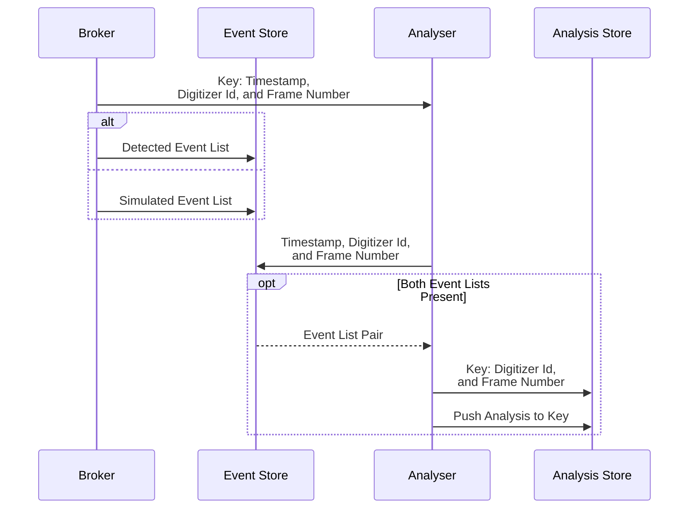
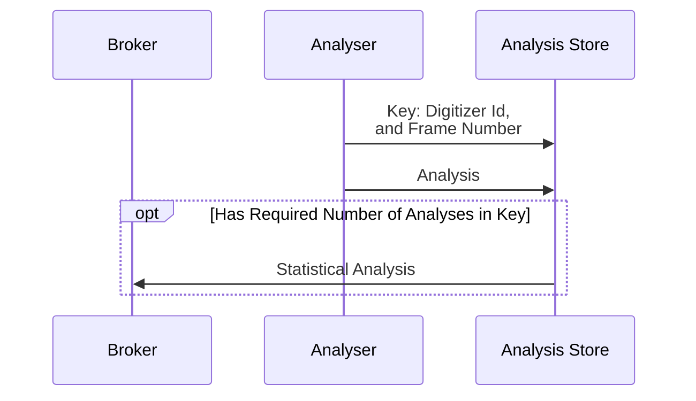
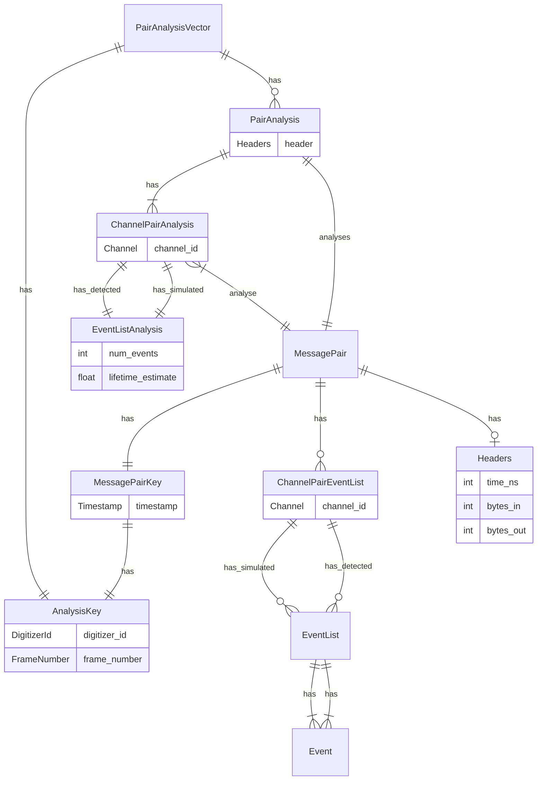

# Events Analyser

```mermaid
sequenceDiagram
participant B as Broker
participant ES as Event Store
participant A as Analyser
participant AS as Analysis Store
B->>A: Key: Timestamp,<br>Digitizer Id, and Frame Number
alt
B->>ES:Detected Event List
else
B->>ES:Simulated Event List
end
A->>ES: Timestamp, Digitizer Id,<br>and Frame Number
opt Both Event Lists Present
ES-->>A: Event List Pair
A->>AS: Key: Digitizer Id,<br>and Frame Number
A->>AS: Push Analysis to Key
end
```

```mermaid
sequenceDiagram
participant B as Broker
participant A as Analyser
A->>AS: Key: Digitizer Id,<br>and Frame Number
A->>AS: Analysis
opt Has Required Number of Analyses in Key
AS->>B: Statistical Analysis
end
participant AS as Analysis Store
```

```mermaid
erDiagram
AnalysisKey {
    DigitizerId digitizer_id
    FrameNumber frame_number
}

MessagePairKey ||--|| AnalysisKey : has
MessagePairKey {
    Timestamp timestamp
}

Headers {
    int time_ns
    int bytes_in
    int bytes_out
}
ChannelPairEventList {
    Channel channel_id
}


EventList ||--|{ Event: has
EventList ||--|{ Event: has
ChannelPairEventList ||--o{ EventList : has_simulated
ChannelPairEventList ||--o{ EventList : has_detected


MessagePair ||--|| MessagePairKey : has
MessagePair ||--o{ ChannelPairEventList : has
MessagePair ||--o| Headers: has

ChannelPairAnalysis {
    Channel channel_id
}
ChannelPairAnalysis ||--|| EventListAnalysis : has_detected
ChannelPairAnalysis ||--|| EventListAnalysis : has_simulated

EventListAnalysis {
    int num_events
    float lifetime_estimate
}

PairAnalysis {
    Headers header
}


ChannelPairAnalysis }|--||MessagePair : analyse
PairAnalysis ||--}| ChannelPairAnalysis : has

PairAnalysis ||--|| MessagePair : analyses
PairAnalysisVector ||--|| AnalysisKey : has
PairAnalysisVector ||--o{ PairAnalysis : has
```