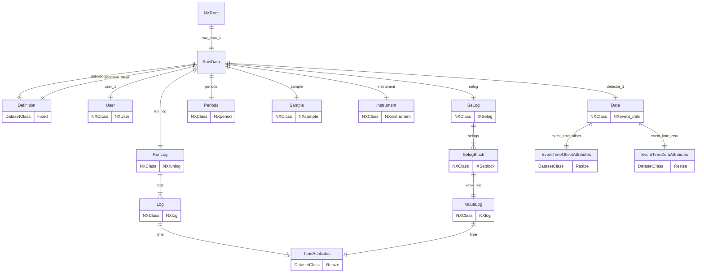

# Nexus File Structure

```mermaid
erDiagram

NXRoot["NXRoot"] {

}

NXRoot ||--|| RawData : raw_data_1

RawData["RawData"] {

}

RawData ||--|| Definition : definition
RawData ||--|| Definition : definition_local
RawData ||--|| User : user_1
RawData ||--|| RunLog : run_log
RawData ||--|| SeLog : selog
RawData ||--|| Periods : periods
RawData ||--|| Sample : sample
RawData ||--|| Instrument : instrument
RawData ||--|| Data : detector_1

Definition["Definition"] {
    DatasetClass Fixed
}

User["User"] {
    NXClass NXUser
}

RunLog["RunLog"] {
    NXClass NXrunlog
}

RunLog ||--|{ Log: logs

Log["Log"] {
    NXClass NXlog
}

Log ||--|| TimeAttributes : time

TimeAttributes["TimeAttributes"] {
    DatasetClass Resize
}

SeLog["SeLog"] {
    NXClass IXSelog
}

SeLog ||--|{ SelogBlock: selogs

SelogBlock["SelogBlock"] {
    NXClass IXSeblock
}

SelogBlock ||--|| ValueLog : value_log

ValueLog["ValueLog"] {
    NXClass NXlog
}

ValueLog ||--|| TimeAttributes : time

Periods["Periods"] {
    NXClass NXperiod
}

Sample["Sample"] {
    NXClass NXsample
}

Instrument["Instrument"] {
    NXClass NXinstrument
}

Data["Data"] {
    NXClass NXevent_data
}

Data ||--|| EventTimeOffsetAttributes : event_time_offset
Data ||--|| EventTimeZeroAttributes : event_time_zero

EventTimeOffsetAttributes["EventTimeOffsetAttributes"] {
    DatasetClass Resize
}

EventTimeZeroAttributes["EventTimeZeroAttributes"] {
    DatasetClass Resize
}

```
